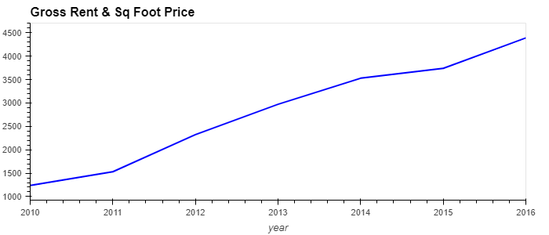
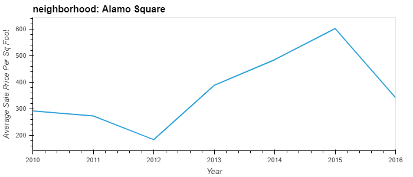
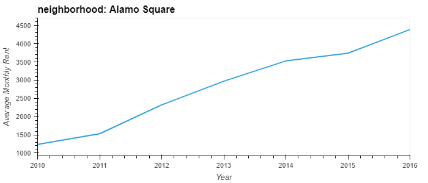
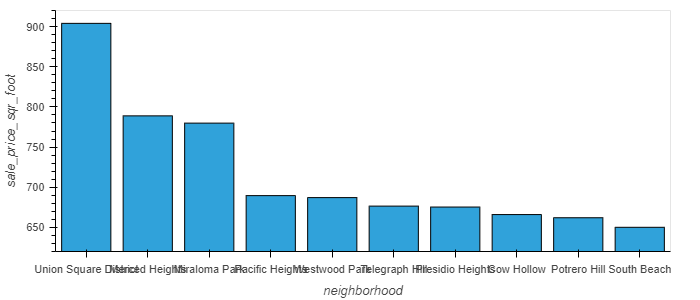
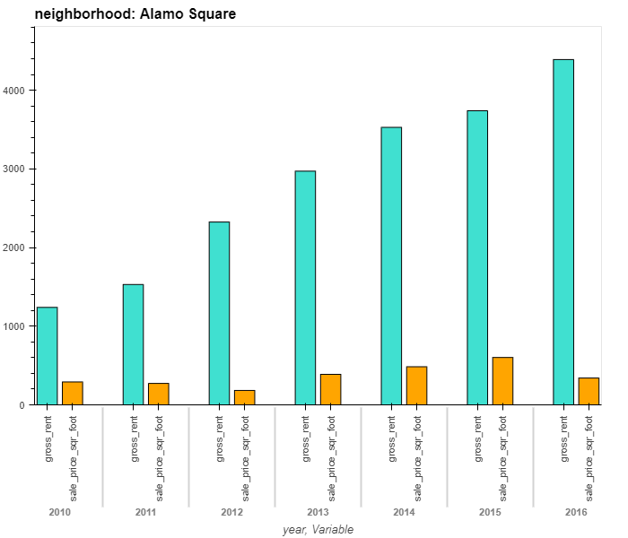
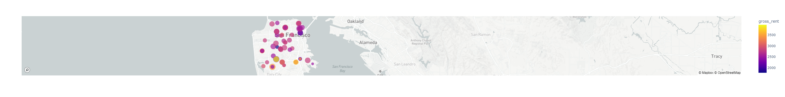

# Week 6 Plot Homework
## Welcome to my plots for the timespan of 2010-2016 San Francisco

### This is the plot of Housing units in San Francisco of the selected neighbourhoods for the years 2010 to 2016.

### This is the graph of Gross Rent, as you can see rent has been steadily climbing for the past years.

### Use the drop down menu on the right to see the different sale prices per sq foot for different neighbourhoods.
 
### Use the drop down menu on the right to see the different rental prices for different neighbourhoods.

### Here we have the top 10 most expensive neighborhoods to buy, in dollars per sq foot.
 
### Here hwe have a comparison of the gross rent vs. the sale price per sq foot. Use the dropdown box on the right to view different neighbourhoods.

### Here is a map of San Francisco, with the neighbour hoods mapped out on a map. Use the scroll wheel to zoom in, the neighbourhoods are marked by colour and size, each representing rent and sale price, respectively.
